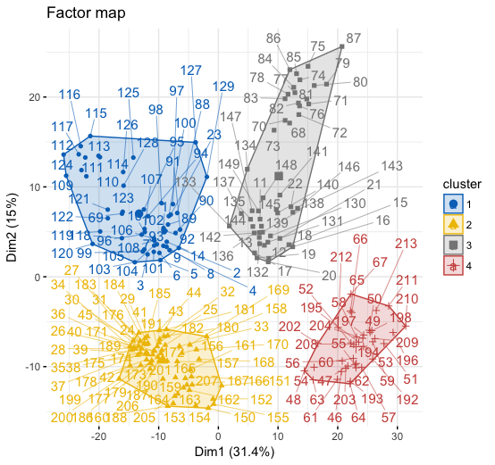

## Plan

Partie I : Commun à toutes les données

1. Introduction
2. Exploration des données

Partie II : Spécifique à chaque jeu de données

3. Analyse en composante principale
4. Clustering avec package Nbclust
5. Clustering à partir des deux premère composantes
6. Spectral clustering
7. Proposition d'un nombre de classes
8. Modèle de mélange
9. MclustDR
10. Etudes comparatives des performances
11. Cluspa

***
>Librairies

```{r, LibraryCheck, message=FALSE, warning=FALSE}
library(R.matlab)
library(FactoMineR)
library(NbClust)
library(kernlab)
library(Rmixmod)
library(mclust)
library(factoextra)
library(corrplot)
library(cluster)
```


## 1. Introduction 

Nous avons pour but dans ce projet de mettre en corrélation nos compétences acquises dans le cours de réduction de dimension ainsi qu'en modèle de mélange. En appliquant des algotithmes sur différents jeu de données qui ont pour point commun être des bases de données d'images. Une fois ces algorithmes lancé nous devions faire un travail d'analyse, d'interprêtations et de comparaison pour trouver selon nous ce qui nous semble être les solutions les plus cohérentes et meilleures. 

Description des jeu de données : 
------------------------------

**Columbia University Image Library (Coil20 Processed)** : Base de données contenant 1440 images de 20 objets différents pris sous différents angles. Ce jeu de données est composé de 1440 observations et 1024 variables. 
Ces 20 objets forments 20 classes avec 72 individus dans chacune de ces classes. Ces 72 individus correspondent aux 72 photos pris sous différents angles. 
1024 variables représentent les pixels car chaque images mesure 32*32 = 1024 pixels. 

**Japanese Female Facial Expression (JAFFE)** : Base de données contenant 213 photos de 10 femmes représentant 7 émotions (dont une neutre). Ce jeu de données est composé de 213 individus rangés dans un 10 classes qui correspondent aux 10 femmes.
Les 676 variables représentent les pixels car chaque images mesure 26*26 = 676 pixels

**Multi-Feature digit (MFEAT1)** : Cet ensemble de données est constitué de caractéristiques de chiffres manuscrits (0 à 9)
extrait d'une collection de cartes d'utilité néerlandaises. 200 motifs par
classe (pour un total de 2 000 modèles) ont été numérisés en binaire. Ce jeu données est composé de 2000 observations et 240 variables.

**Mixed National Institute of Standards and Technology (MNIST)** : La base MNIST est devenu un test standard1. Elle regroupe 60.000 images d'apprentissage et 10.000 images de test, issues d'une base de données antérieure, appelée simplement NIST1. Ce sont des images en noir et blanc, normalisées centrées de 28 pixels de côté. Ce jeu de données (réduit) est composé de 3495 observations et 784 variables.

***

## 2. Chargement des données

```{r,eval=FALSE, message=FALSE, warning=FALSE, include=FALSE,results='hide'}
coil <- readMat("data/DATA_MATLAB - Projet-master-MLDS/COIL20_1440n_1024d_20c.mat")
jaffe <- readMat("data/DATA_MATLAB - Projet-master-MLDS/jaffe.mat")
mnist <- readMat("data/DATA_MATLAB - Projet-master-MLDS/MNIST5.mat")
mfeat <- readMat("data/DATA_MATLAB - Projet-master-MLDS/MFEAT1.mat")
```

Séparation en data et label
-------------------------

Chaque datasets est au format .mat ils contiennent tous une colonne "Y" correspondants à la classe ou variable à expliquer ainsi que des varibles explicatives ou features "X".

Nous les avons assignées dans des différentes variables pour plus de faciliter et de clarté dans notre code.

```{r,eval=FALSE, message=FALSE, warning=FALSE, include=FALSE,results='hide'}
coil.data <- coil$X
coil.label <- coil$y

jaffe.data <- jaffe$X
jaffe.label <- jaffe$y

mfeat.data <- mfeat$X
mfeat.label <- mfeat$y

mnist.data <- mnist$X
mnist.label <- mnist$y
```


## 3. Analyse en composante principale

Dans cette étude de l'ACP nous allons plus nous intéresser aux individus. Car pour la suite ce qui nous intérèsse est le partitionnement de ceux-là.

Coil data
---------

```{r,eval=FALSE, message=FALSE, warning=FALSE, include=FALSE,results='hide'}
pca.coil <- PCA(coil.data)
```

Obs : ci-dessous on retrouve une visualisation du plan d'individus factorielle issu de l'ACP.(Le cercle de corrélation des variables n'est pas affiché du fait que l'on peux pas distinguer des variables pertinentes ou non dans notre analyse)


```{r,eval=FALSE, message=FALSE, warning=FALSE, include=FALSE,results='hide'}
fviz_eig(pca.coil, addlabels = TRUE, ylim = c(0, 50),main = "Graphique des valeurs propres cumulées par dimensions")
```

En se basant sur la méthode du coude nous nous assurons bien que les deux composantes (1 et 2) sont les plus répresentative de notre jeu de données de base ainsi notre nuage de point sera le plus représentatif. Mais on remarque aussi qu'en terme de variance expliquée pour les deux dimensions on se retrouve qu'à environ 35% ce qui est faible.


De plus on peux s'intéresser à la qualité de représentation du nuage d'individu. Un point est dit bien représenté sur un axe ou un plan factoriel si il est proche de sa projection sur l’axe ou le plan. S’il est éloigné, on dit qu’il est mal représenté. Indicateur =angle formé entre le point et sa projection sur l’axe. Lorsque l’angle est proche de 0, c'est-à-dire que le cosinus est proche de 1, l’individu est bien représenté. Dans le cas inverse, l’angle est proche de 90° et le cosinus est proche de 0

Cependant au vu du nombre d'observations que l'on à afficher le graphe du cos2 par individu ne serait pas très pertinents car graphiquement parlant il ne serait pas possible de définir quel individu à une meilleure qualité de représentation qu'un autre. De même que pour la contributions des individus au composantes 1 et 2. 

***

Jaffe data
----------

```{r,eval=FALSE, message=FALSE, warning=FALSE, include=FALSE,results='hide'}
pca.jaffe <- PCA(jaffe.data)
```

Obs : Ci-dessous on retrouve une visualisation du plan d'individus factorielle issu de l'ACP.(Le cercle de corrélation des variables n'est pas affiché du fait que l'on peux pas distinguer des variables pertinentes ou non dans notre analyse)

De même que pour l'ACP du jeu de données Coil on remarque une répartition des individu très distincte ce qui dans un premier temps peut nous renseigner sur le fait que les individus ne sont pas identiques ou colporte la même informations (présence de doublons)


Méthode du coude : 
Dim 1 = 31,4% variance expliquée (valeurs propres)
Dim 2 = 15% variance expliquée (valeurs propres)

```{r,eval=FALSE, message=FALSE, warning=FALSE, include=FALSE,results='hide'}
fviz_eig(pca.jaffe, addlabels = TRUE, ylim = c(0, 50),main = "Graphique des valeurs propres cumulées par dimensions")
```


Qualité de représentation : 

```{r,eval=FALSE, message=FALSE, warning=FALSE, include=FALSE,results='hide'}
fviz_pca_ind (pca.jaffe, col.ind = "cos2",
              gradient.cols = c("#00AFBB", "#E7B800", "#FC4E07"),
              repel = TRUE # Évite le chevauchement de texte
)
```

Il s'agit d'une représentation des individus catégorisé de par leurs valeurs du cos2. On remarque les points présentant des similarité sont regroupés. On remarque 6 foyers. (Nous précisons foyers sans aucun cas faire allusion à des partitions ou classes)


***

**Mnist data**

Obs :

```{r,eval=FALSE, message=FALSE, warning=FALSE, include=FALSE,results='hide'}
pca.mnist <- PCA(mnist.data)
```

***

**Mfeat data**

Obs :

```{r,eval=FALSE, message=FALSE, warning=FALSE, include=FALSE,results='hide'}
pca.mfeat <- PCA(mfeat.data)
```

## 4. Clustering avec package Nbclust 

*En bref : Le package NbClust inclus une fonction NbClust() qui utilise 30 indices pour déterminer le nombre de clusters et propose d'utiliser le meilleur schéma de clusters à partir des différents résultats obtenus en faisant varier toutes les combinaisons de nombre de clusters (renseigné ou non au préalable par les param min.nc et max.nc) de mesures de distance et de méthodes de clusters.*

REM : Nous avons détaillé notre méthodologie de travail pour Coil data --> Kmeans afin de montrer comment nous sommes parvenus aux résultats obtenu ainsi que les deux différentes structure trouvées. Pour le reste nous avons juste affiché les résultats car la méthode est la même.

Coil data
---------


Obs : Les données étant labelisé nous savons que le jeu de données coil contient 20 classes. Le but à travers l'éxecutions de ces algorithmes est de trouver un modèle qui égale au mieux les classes des données

```{r,eval=FALSE, message=FALSE, warning=FALSE, include=FALSE,results='hide'}
kmeans.coil = NbClust(data = coil.data, method = "kmeans",min.nc = 10,max.nc = 20)
KmeansBestPartAllIndex = kmeans.coil$Best.partition

kmeans.coil3Index = NbClust(data = coil.data, method = "kmeans",min.nc = 15,max.nc = 20,index = c("ccc","db","silhouette"))
KmeansBestPart3Index = kmeans.coil3Index$Best.partition
```

**Kmeans**

Vote majoritaire propose un regroupement en **10 classes**. 
Cependant selon les index Cubic CLustering Criterion (ccc), l'index Silhouette et l'index Davies and Bouldin (db) proposent un clustering à 20 classes. Avec comme score suivant

```{r}
kmeansCoil20res <- data.frame(CCC="62.3",DB = "1.76",SILHOUETTE = "0.24",row.names = "Score")
kmeansCoil20res
```

 Le point commun de ces index est qu'ils mesurent tous la qualité des clusters. Cependant il est assez complexe de les comparer car ils ne se basent pas sur les mêmes metrics pour ressortir leurs résultats. Ex : Plus l'index db est faible plus les données sont bien classés.  Il évalue la similarité intra classe et la différence inter classes. 

Or que l'index silhouette lui va mesurer la distance entre chaque points de données avec le centre de gravité de la classe et vérifie que les points assigné à chaque centre de gravité sont bien les plus proches. 

Résultats normalisé : Silhouette & non normalisé : CCC et DB. Difficulté de plus pour comparer. 

Nous avons relançant kmeans avec la fonction nbclust juste avec les index cités au-dessus et stocker dans une variable le résultat de la meilleure partition avec 20 classes.

REM : *les résultats provenant du tableau ci-dessus sont renseigné à titre indicatif non comparatif*

Effectif des classes :

```{r}
table(effectif = kmeans.coil$Best.partition)
```


**Average**

Le vote majoritaire propose un regroupement en **14 classes**. 
Cependant selon les index Davies and Bouldin (db) et Sdbw proposent un clustering à 20 classes.

Effectif des classes :

```{r}
table(effectif = average.coil$Best.partition)
```

**Ward**

Le vote majoritaire propose un regroupement en **10 classes**. 
Cependant selon les index Silhouette, Cindex et CCC proposent un clustering à 20 classes.

Effectif des classes :

```{r}
table(effectif = ward.coil$Best.partition)
```

**Single**

Le vote majoritaire propose un regroupement en **2 classes**. 
Aucun propose 20 clusters.

Effectif des classes :

```{r}
table(effectif = single.coil$Best.partition)
```

**Complete**

Le vote majoritaire propose un regroupement en **13 classes**. 
Cependant selon l'index Silhouette propose un clustering à 20 classes.

Effectif des classes :

```{r}
table(effectif = complete.coil$Best.partition)
```


***

Jaffe data
----------

Obs : Les algorithmes sont lancés uniquement qu'en se basant sur l'index silhouette pour cause d'erreur avec d'autres index qui font planté la bonne éxecutions de ces algo. 

```{r,eval=FALSE, message=FALSE, warning=FALSE, include=FALSE,results='hide'}
kmeans.jaffe = NbClust(jaffe$X, method = "kmeans",min.nc = 2,max.nc = 10,index = "silhouette")
```

**Kmeans**

Vote majoritaire propose un regroupement en **10 classes**.

Effectif des classes :

```{r}
table(effectif = kmeans.jaffe$Best.partition)
```

**Average**

Le vote majoritaire propose un regroupement en **9 classes**. 

Effectif des classes :

```{r}
table(effectif = average.jaffe$Best.partition)
```

**Ward**

Le vote majoritaire propose un regroupement en **7 classes**.

Effectif des classes :

```{r}
table(effectif = ward.jaffe$Best.partition)
```

**Single**

Le vote majoritaire propose un regroupement en **7 classes**. 

Effectif des classes :

```{r}
table(effectif = single.jaffe$Best.partition)
```

**Complete**

Le vote majoritaire propose un regroupement en **6 classes**.

Effectif des classes :

```{r}
table(effectif = complete.jaffe$Best.partition)
```

***

**Mfeat data**

Obs : 

```{r,eval=FALSE, message=FALSE, warning=FALSE, include=FALSE,results='hide'}
kmeans.mfeat = NbClust(data = mfeat.data, method = "kmeans")
kmeans.mfeat.part = kmeans.mfeat$Best.partition

average.mfeat =NbClust(data = mfeat.data, method = "average")
average.mfeat.part =average.mfeat$Best.partition

ward.mfeat = NbClust(data = mfeat.data, method = "ward.D")
ward.mfeat.part = ward.mfeat$Best.partition

single.mfeat = NbClust(data = mfeat.data, method = "single")
single.mfeat.part = single.mfeat$Best.partition

complete.mfeat = NbClust(data = mfeat.data, method = "complete")
complete.mfeat.part = complete.mfeat$Best.partition
```

***

**mnist data** 

Obs : 

```{r,eval=FALSE, message=FALSE, warning=FALSE, include=FALSE,results='hide'}
kmeans.mnist = NbClust(data = mnist.data, method = "kmeans")
kmeans.mnist.part = kmeans.mnist$Best.partition

average.mnist =NbClust(data = mnist.data, method = "average")
average.mnist.part =average.mnist$Best.partition

ward.mnist = NbClust(data = mnist.data, method = "ward.D")
ward.mnist.part = ward.mnist$Best.partition

single.mnist = NbClust(data = mnist.data, method = "single")
single.mnist.part = single.mnist$Best.partition

complete.mnist = NbClust(data = mnist.data, method = "complete")
complete.mnist.part = complete.mnist$Best.partition
```


## 5. Clustering à partir des deux premère composantes

*En bref : L’approche HCPC (Hierarchical Clustering on Principal Components ou Classification Hiérarchique sur Composantes Principales) nous permet de combiner les trois méthodes standards utilisées dans les analyses de données multivariées c'est à dire les méthodes des composantes principales (ACP...); la classification ascendante hiérarchique et le partitionnement en k-moyennes.*

Rem : Dans cette partie nous avons paramétré la fonction HCPC à -1 afin qu'il nous propose pour lui le meilleure découpage du dendogramme. Nous aurions pu nous même ajuster le nombre de clusters mais il est plus interessant de comparer les méthodes et leurs déduction des meilleures cluster que d'initialisé par nous même. 

**Coil data**

HCPC propose 3 clusters distincts 

```{r, eval=FALSE, message=FALSE, warning=FALSE, include=FALSE, results='hide',echo='FALSE'}
hcpc.coil <- HCPC(pca.coil,nb.clust = -1,graph = TRUE)
```

Visualisation du dendrogramme généré avec prise en compte des clusters proposé par HCPC

```{r, eval=FALSE, message=FALSE, warning=FALSE, include=FALSE, results='hide',echo='FALSE'}
fviz_dend(hcpc.coil,
          palette = "jco",               # Palette de couleur 
          rect = TRUE, rect_fill = TRUE, # Rectangle autour des groupes
          rect_border = "jco"           # Couleur du rectangle
          )
```


Visualisation des individus sur un plan factoriel regroupé en fonction des classes par couleurs avec prise en compte des clusters proposé par HCPC

```{r, eval=FALSE, message=FALSE, warning=FALSE, include=FALSE, results='hide',echo='FALSE'}
fviz_cluster(hcpc.coil,
             repel = TRUE,            # Evite le chevauchement des textes
             show.clust.cent = TRUE, # Montre le centre des clusters
             palette = "jco",         # Palette de couleurs, voir ?ggpubr::ggpar
             ggtheme = theme_minimal(),
             main = "Factor map"
             )
```


***

**Jaffe data** 

HCPC propose 4 clusters distincts 

```{r,eval=FALSE, message=FALSE, warning=FALSE, include=FALSE,results='hide'}
hcpc.Jaffe <- HCPC(pca.jaffe,nb.clust = -1,graph = TRUE)
```

Visualisation du dendrogramme généré avec prise en compte des clusters proposé par HCPC

```{r, eval=FALSE, message=FALSE, warning=FALSE, include=FALSE, results='hide',echo='FALSE'}
fviz_dend(hcpc.coil,
          palette = "jco",               # Palette de couleur 
          rect = TRUE, rect_fill = TRUE, # Rectangle autour des groupes
          rect_border = "jco"           # Couleur du rectangle
          )
```


Visualisation des individus sur un plan factoriel regroupé en fonction des classes par couleurs avec prise en compte des clusters proposé par HCPC

```{r, eval=FALSE, message=FALSE, warning=FALSE, include=FALSE, results='hide',echo='FALSE'}
fviz_cluster(hcpc.coil,
             repel = TRUE,            # Evite le chevauchement des textes
             show.clust.cent = TRUE, # Montre le centre des clusters
             palette = "jco",         # Palette de couleurs, voir ?ggpubr::ggpar
             ggtheme = theme_minimal(),
             main = "Factor map"
             )
```



***

**Mfeat data**

Obs : 

```{r,eval=FALSE, message=FALSE, warning=FALSE, include=FALSE,results='hide'}
HCPC(pca.mfeat)
```

***

**Mnist data**

Obs : 

```{r,eval=FALSE, message=FALSE, warning=FALSE, include=FALSE,results='hide'}
HCPC(pca.mnist)
```


## 6. Spectral clustering

**En bref : le Spectral Clustering c’est trois étapes :Construire une matrice qui représente les affinités entre les individus; Projeter les individus sur un plan en fonction de leurs affinités et Appliquer une méthode classique de clustering (le plus souvent une K-means) sur ces nouvelles coordonnées.**

Pour réaliser notre spectral clustering nous utilisons le package kernlab qui contiens la fonction specc() qui est le kmeans spectrale

**Coil data**

Nous devons initialisé notre algorithme par un nombre de clusters souhaité. Nous allons directement l'initialisé aux nombres de classes adéquat c'est à dire 20 pour le jeu de données Coil. Nous allons voir en terme d'effectif s'il arrive à classer les individus au mieux donc plus proche de la réalité.

```{r,eval=FALSE, message=FALSE, warning=FALSE, include=FALSE,results='hide'}
n.cluster.coil = 20
specc.coil = specc(x = coil.data, n.cluster.coil)
```

Effectif des classes suite au kmeans spectrale

```{r}
#table(spect.coil$)
```

***

**Jaffe data**

```{r,eval=FALSE, message=FALSE, warning=FALSE, include=FALSE,results='hide'}
n.cluster.jaffe = 10
specc.jaffe = specc(x = jaffe.data, n.cluster.jaffe)
```

Effectif des classes suite au kmeans spectrale

```{r}
#table(specc.jaffe$)
```

***

**Mfeat data**

Obs : 

```{r,eval=FALSE, message=FALSE, warning=FALSE, include=FALSE,results='hide'}
n.cluster.mfeat = 9
spect.mfeat = specc(x = mfeat.data, n.cluster.mfeat)
```

***

**Mnist data** 

Obs : 

```{r,eval=FALSE, message=FALSE, warning=FALSE, include=FALSE,results='hide'}
n.cluster.mnist = 9
spect.mnist = specc(x = mnist.data, n.cluster.mnist)
```


## 7. Proposition d'un nombre de classes

Pour choisir le nombre de classes nous allons nous basé sur ce que nous avons réalisé au préalable.

Nous avons réalisé des méthodes qu'on pourrait qualifier d'automatique c'est à dire qu'on a laissé les algorithmes nous proposé selon leurs calculs un nombre de clusters ainsi qu'une répartition de la population. (Nbclust et HCPC). Puis nous avons initialisé par nous même le nombre de cluster avec le kmeans specc. 

 
**Coil data**

Proposition : 

**Jaffe data** 

Proposition : 

**Mfeat data** 

Proposition : 

**Mnist data** 

Proposition : 

## 8. Modèle de mélange

**En bref : Dans les modèles de mélanges, fréquemment utilisés en classification automatique, on considère qu'un échantillon de données suit, non pas une loi de probabilité usuelle, mais une loi dont la fonction de densité est une densité mélange. N'importe quelle loi peut être utilisée, la plus courante est la loi normale dont la fonction de densité est une gaussienne. On parle alors de mélange gaussien**

**Coil data**

Obs : 

```{r,eval=FALSE, message=FALSE, warning=FALSE, include=FALSE,results='hide'}
mclust.coil = Mclust(coil.data)
mixmomixmodCluster(geyser,3)
```

```{r,eval=FALSE, message=FALSE, warning=FALSE, include=FALSE,results='hide'}
mclust.coil = Mclust(coil.data)
mixmodCluster(geyser,3)
```

***

**Jaffe data** 

Obs : 

```{r,eval=FALSE, message=FALSE, warning=FALSE, include=FALSE,results='hide'}
n.cluster.jaffe = 9
spect.jaffe = specc(x = jaffe.data, n.cluster.jaffe)
```

***

**Mfeat data** 

Obs : 

```{r,eval=FALSE, message=FALSE, warning=FALSE, include=FALSE,results='hide'}
mclust.mfeat = Mclust(mfeat.data)
```

***

**Mnist data**

Obs : 

```{r,eval=FALSE, message=FALSE, warning=FALSE, include=FALSE,results='hide'}
n.cluster.mnist = 9
spect.mnist = specc(x = mnist.data, n.cluster.mnist)
```

## 9. MclustDR
## 10. Etudes comparatives des performances
## 11. Cluspa
